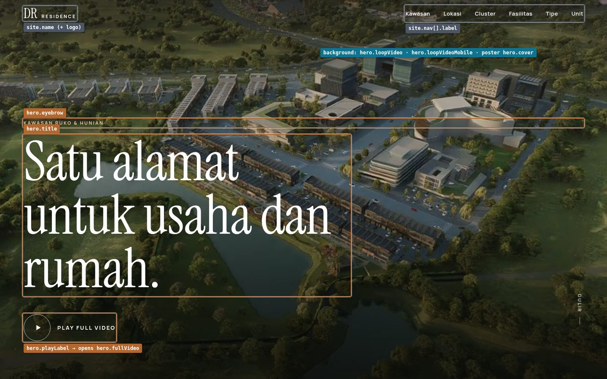
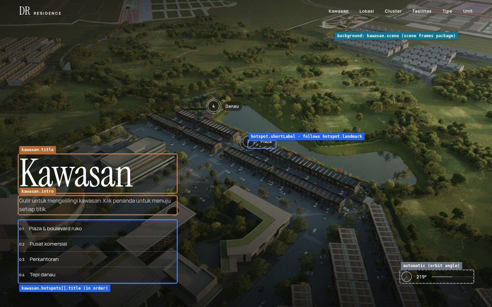
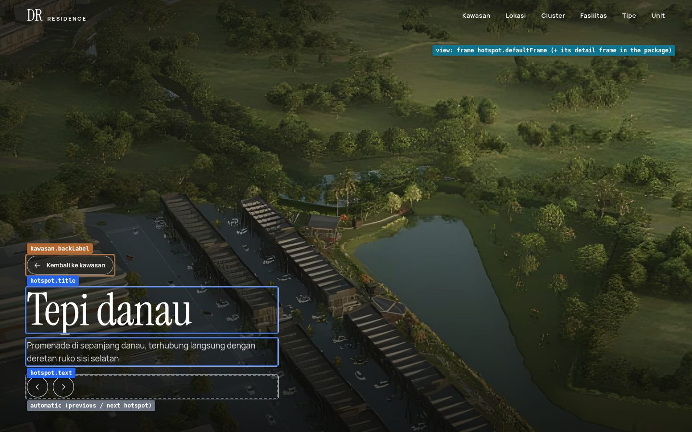
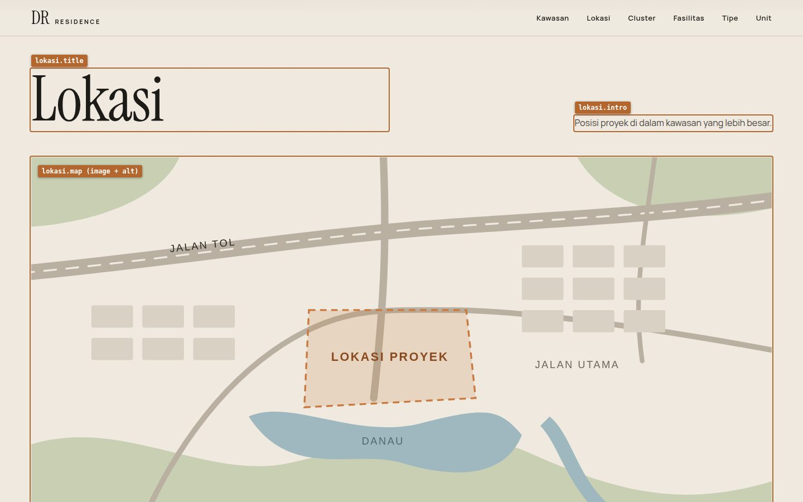
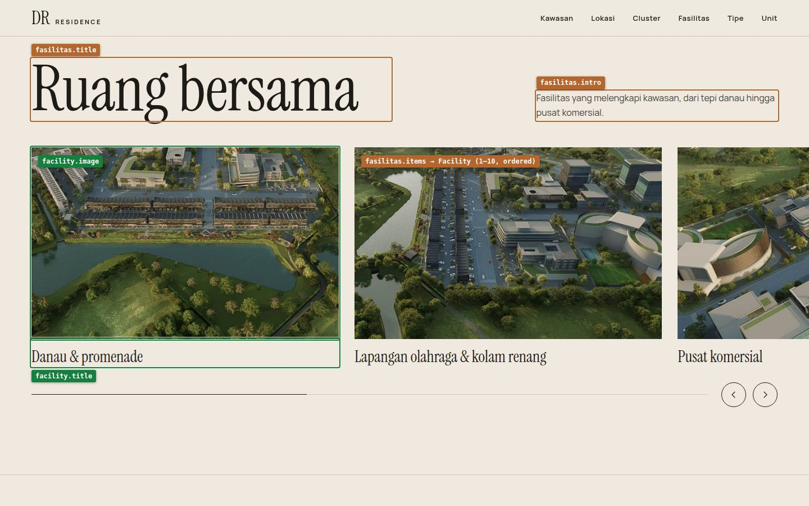
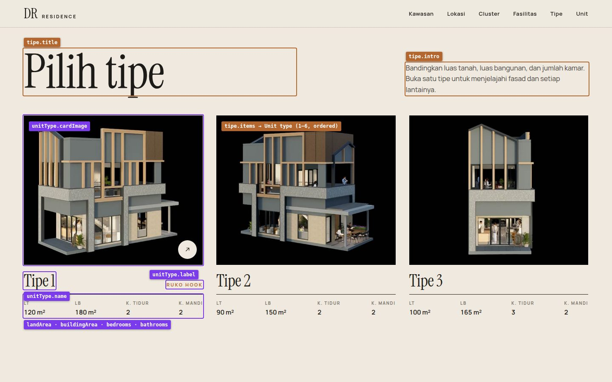
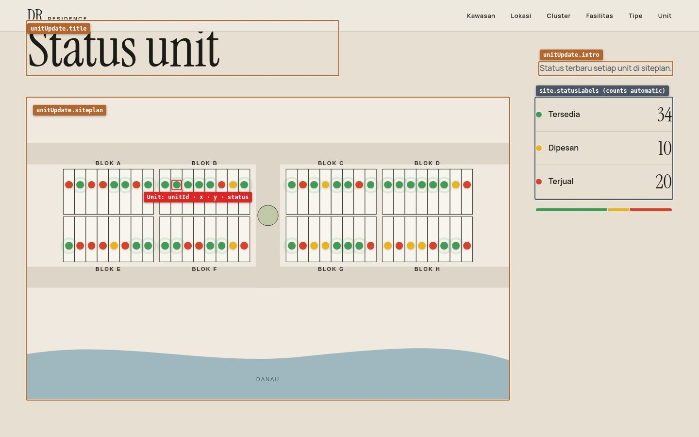
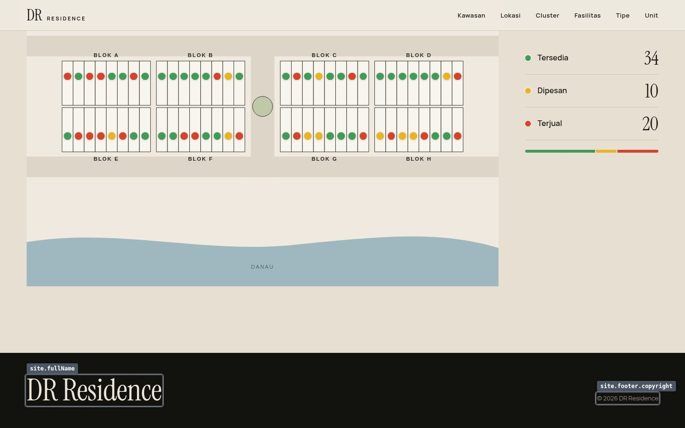
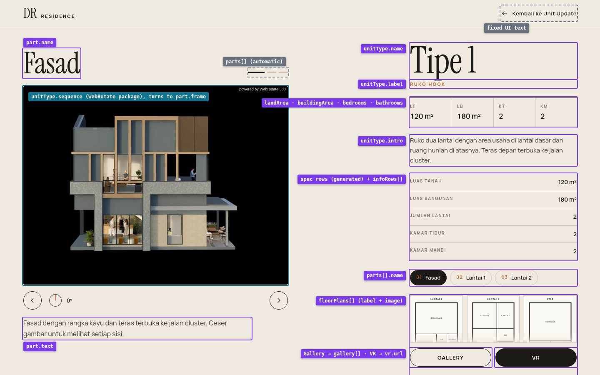
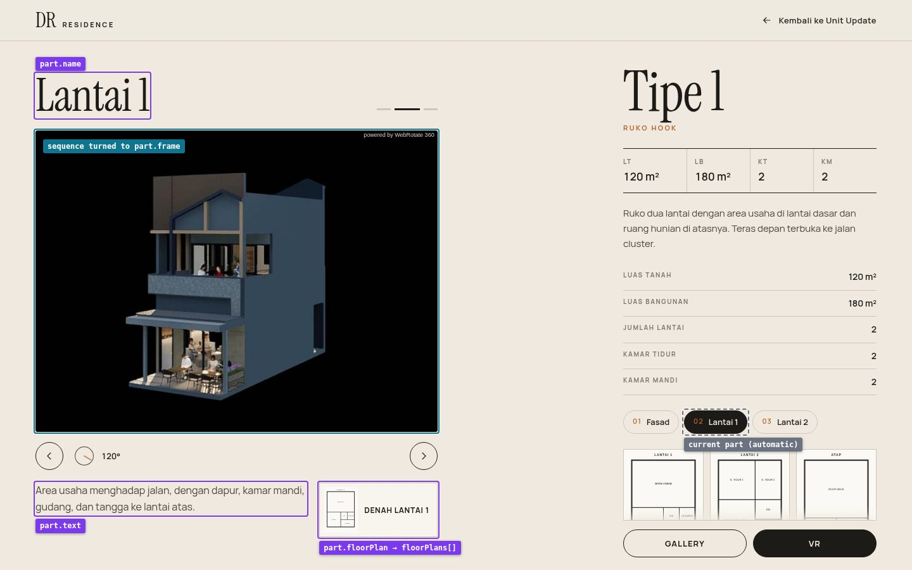

# CMS field map: what each part of the page is

Annotated screenshots of the live pages. Every editable area is outlined and labelled with its CMS field name.
Field definitions, types and limits are in [`CMS-CONTENT-MODEL.md`](CMS-CONTENT-MODEL.md); the section numbers
below (§) point there.

Screenshots: desktop 1440×900, taken from the build of 28 September 2026. Phones show the same fields in a
stacked layout.

## Colour key

| Colour | Model | Who edits it |
|---|---|---|
| **Grey** | Site settings (§4) | Editor, rarely |
| **Orange** | Homepage section fields (§5) | Editor |
| **Blue** | Hotspot, inside Kawasan / Cluster (§6) | Editor |
| **Green** | Facility collection (§7) | Editor |
| **Purple** | Unit type collection (§8) | Editor |
| **Red** | Unit collection, the siteplan dots (§9) | Sales / editor, often |
| **Teal** | Media package (§10) | 3D team / developer uploads; editor only selects |
| **Grey, dashed** | Automatic or fixed, not a CMS field | – |

---

## Homepage

### 1. Hero

| Label on screen | Field | Model | Notes |
|---|---|---|---|
| `site.name (+ logo)` | `name`, `logo` | Site settings §4 | Logo image replaces the text if set. |
| `site.nav[].label` | `nav[].label` + `nav[].section` | Site settings §4 | One entry per header link, in order. |
| `hero.eyebrow` | `hero.eyebrow` | Homepage §5.1 | The only eyebrow on the site. ≤ 40 chars. |
| `hero.title` | `hero.title` | Homepage §5.1 | ≤ 60 chars. |
| `hero.playLabel → opens hero.fullVideo` | `hero.playLabel`, `hero.fullVideo` | Homepage §5.1 | The button opens the full film in an overlay. |
| `background: …` | `hero.loopVideo`, `hero.loopVideoMobile`, `hero.cover` | Homepage §5.1 | The loop must be the same orbit as the Kawasan scene, because the hero hands off to it on scroll. |

### 2. Kawasan (scroll scene)

| Label on screen | Field | Model | Notes |
|---|---|---|---|
| `kawasan.title` | `kawasan.title` | Homepage §5.2 | |
| `kawasan.intro` | `kawasan.intro` | Homepage §5.2 | ≤ 160 chars. |
| `kawasan.hotspots[].title (in order)` | `hotspots[].title` | Hotspot §6 | List order = marker numbers. |
| `hotspot.shortLabel · follows hotspot.landmark` | `shortLabel`, `landmark` | Hotspot §6 | The marker moves with the landmark as the orbit turns. |
| `background: kawasan.scene` | `kawasan.scene` | Media package §10.1 | Frame sequence + manifest. |
| `automatic (orbit angle)` | – | – | Calculated from the scroll position. |

### 3. Kawasan, a location opened

| Label on screen | Field | Model | Notes |
|---|---|---|---|
| `kawasan.backLabel` | `kawasan.backLabel` | Homepage §5.2 | e.g. "Kembali ke kawasan". |
| `hotspot.title` | `title` | Hotspot §6 | |
| `hotspot.text` | `text` | Hotspot §6 | ≤ 240 chars. |
| `view: frame hotspot.defaultFrame …` | `defaultFrame` | Hotspot §6 + Media §10.1 | The orbit turns to this frame and zooms in. A sharp detail frame for it must exist in the package. |
| `automatic (previous / next hotspot)` | – | – | Steps through the hotspots in list order. |

### 4. Cluster (scroll scene)

Same layout and fields as Kawasan (screens 2 and 3), under `cluster.*`: `cluster.title`, `cluster.intro`,
`cluster.scene`, `cluster.hotspots[]`, `cluster.backLabel` (§5.4, §6).

### 5. Lokasi (static map)

| Label on screen | Field | Model | Notes |
|---|---|---|---|
| `lokasi.title` | `lokasi.title` | Homepage §5.3 | |
| `lokasi.intro` | `lokasi.intro` | Homepage §5.3 | |
| `lokasi.map (image + alt)` | `lokasi.map` | Homepage §5.3 | Plain image, no interaction (per the brief). |

### 6. Fasilitas (carousel)

| Label on screen | Field | Model | Notes |
|---|---|---|---|
| `fasilitas.title` | `fasilitas.title` | Homepage §5.5 | Hard-coded in the component today. |
| `fasilitas.intro` | `fasilitas.intro` | Homepage §5.5 | Hard-coded in the component today. |
| `facility.image` | `image` | Facility §7 | 16:10, alt text required. |
| `facility.title` | `title` | Facility §7 | Caption. |
| `fasilitas.items → Facility (1–10, ordered)` | `fasilitas.items` | Homepage §5.5 | Which facilities appear, and in what order. |

### 7. Tipe (card grid)

| Label on screen | Field | Model | Notes |
|---|---|---|---|
| `tipe.title` | `tipe.title` | Homepage §5.6 | Hard-coded in the component today. |
| `tipe.intro` | `tipe.intro` | Homepage §5.6 | Hard-coded in the component today. |
| `unitType.cardImage` | `cardImage` | Unit type §8.1 | Building on black, centred. |
| `unitType.name` | `name` | Unit type §8.1 | |
| `unitType.label` | `label` | Unit type §8.1 | Optional. |
| `landArea · buildingArea · bedrooms · bathrooms` | `landArea`, `buildingArea`, `bedrooms`, `bathrooms` | Unit type §8.1 | Numbers only; units (m²) are added by the site. |
| `tipe.items → Unit type (1–6, ordered)` | `tipe.items` | Homepage §5.6 | Which types appear, and in what order. The card links to the type page. |

### 8. Unit update (siteplan)

| Label on screen | Field | Model | Notes |
|---|---|---|---|
| `unitUpdate.title` | `unitUpdate.title` | Homepage §5.7 | Hard-coded in the component today. |
| `unitUpdate.intro` | `unitUpdate.intro` | Homepage §5.7 | Hard-coded in the component today. |
| `unitUpdate.siteplan` | `unitUpdate.siteplan` | Homepage §5.7 | Replacing it means re-checking every dot position. |
| `Unit: unitId · x · y · status` | `unitId`, `x`, `y`, `status` | Unit §9 | One entry per dot. `x`/`y` are % of the siteplan. Colour follows `status`. |
| `site.statusLabels (counts automatic)` | `statusLabels.*` | Site settings §4 | The counts and the bar are calculated from the Units. |

### 9. Footer

| Label on screen | Field | Model | Notes |
|---|---|---|---|
| `site.fullName` | `fullName` | Site settings §4 | |
| `site.footer.copyright` | `footer.copyright` | Site settings §4 | Defaults to "© {year} {fullName}". |

---

## Unit type page (`/tipe/{slug}/`)

### 10. Facade (first part)

| Label on screen | Field | Model | Notes |
|---|---|---|---|
| `part.name` | `parts[].name` | Unit type §8.3 | Title of the part currently shown. |
| `parts[] (automatic)` | – | – | One bar per part; clicking jumps to it. |
| `unitType.sequence (WebRotate package), turns to part.frame` | `sequence` | Media package §10.2 | The one 360° sequence for the type. Visitors can also drag it. |
| `part.text` | `parts[].text` | Unit type §8.3 | |
| `unitType.name` | `name` | Unit type §8.1 | |
| `unitType.label` | `label` | Unit type §8.1 | |
| `landArea · buildingArea · bedrooms · bathrooms` | spec fields | Unit type §8.1 | Same numbers as the card; entered once. |
| `unitType.intro` | `intro` | Unit type §8.1 | |
| `spec rows (generated) + infoRows[]` | `infoRows[]` | Unit type §8.1 | Land/building area, floors, bedrooms and bathrooms are generated from the specs; `infoRows` adds extra rows. |
| `parts[].name` | `parts[].name` | Unit type §8.3 | Part chips: clicking one moves the sequence to that part. |
| `floorPlans[] (label + image)` | `floorPlans[]` | Unit type §8.4 | Thumbnails; open in a lightbox. |
| `Gallery → gallery[] · VR → vr.url` | `gallery[]`, `vr.url`, `vr.mode` | Unit type §8.4 | The VR button is hidden when `vr.url` is empty. |
| `fixed UI text` | – | – | "Kembali ke Unit Update". Could become a Site settings label if it needs editing. |

### 11. A floor part (after scrolling or choosing "Lantai 1")

| Label on screen | Field | Model | Notes |
|---|---|---|---|
| `part.name` | `parts[].name` | Unit type §8.3 | |
| `sequence turned to part.frame` | `parts[].frame` | Unit type §8.3 | The keyframe the sequence animates to. |
| `part.text` | `parts[].text` | Unit type §8.3 | |
| `part.floorPlan → floorPlans[]` | `parts[].floorPlan` | Unit type §8.3 | Which floor plan to offer with this part (matched by label). |
| `current part (automatic)` | – | – | Follows the scroll position. |

---

## Not on these screens

- **Overlays:** the lightbox (gallery, floor plans) and the video overlay use the fields above; their controls are
  fixed UI.
- **SEO fields** (`seo.*`) and **Unit.note / Unit.type / Unit.block** are not visible on the page (§4, §8.5, §9).
- **Placeholder badges** and the **WebRotate license** are developer settings, not CMS fields.
